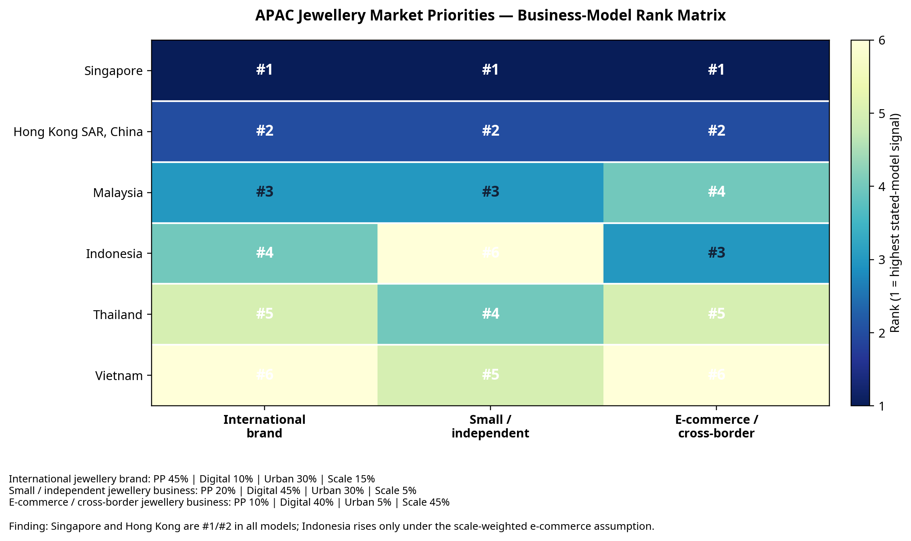
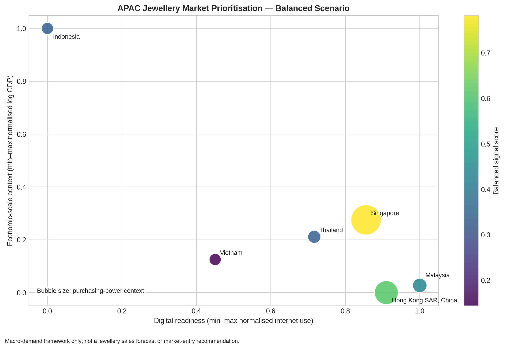
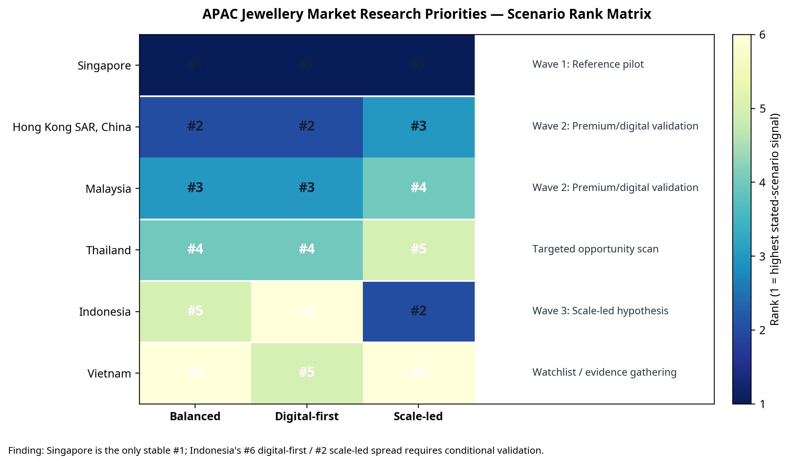

# APAC Jewellery Market Prioritisation

## A reproducible macro-demand framework for product-planning research

This portfolio demonstrates a disciplined approach to **regional market prioritisation** for a jewellery business. It converts public, consistently dated macroeconomic and digital-access indicators into a transparent research framework for deciding **where to prioritise further market validation and digital-localisation work**.

> **Scope and discipline.** This is not a jewellery sales forecast, market-size estimate, investment recommendation, or a claim that any market should be entered. It does not measure category demand, price elasticity, consumer willingness to pay, margin, regulations, competitor intensity or store economics. It is an evidence-led first screen designed to structure the next research question.

## Business question

> Across selected APAC markets, which markets should be prioritised for the next stage of jewellery market research and digital-localisation validation, when assessed through a transparent set of 2024 macro-demand proxies?

The selected markets are Hong Kong SAR, China; Singapore; Thailand; Malaysia; Vietnam; and Indonesia. Mainland China is strategically important but is not included in the comparable panel: a robust China analysis would require a separate city-tier and domestic-consumption dataset rather than being folded into a cross-country proxy model.

## Executive finding and decision statement

> **Allocate the next research cycle in three waves:** establish a reference pilot in **Singapore**; validate premium/digital propositions in **Hong Kong** and **Malaysia**; and assess **Indonesia** only as a scale-led, affordability-and-channel hypothesis. Keep **Thailand** in a targeted opportunity scan and **Vietnam** on an evidence-gathering watchlist.

The conclusion is derived from the model’s three explicit scenarios—not from a single rank. Singapore is the only market ranked **#1 in balanced, digital-first and scale-led scenarios**. Hong Kong and Malaysia perform relatively better under the digital-first assumptions than under the scale-led assumptions, while Indonesia moves from **#6 digital-first to #2 scale-led**. This means Indonesia is a potentially important follow-on market, but only if commercial conditions beyond macro scale can be proven.

| Market | Scenario ranks: balanced / digital-first / scale-led | Conclusion | Next management action |
|---|---:|---|---|
| Singapore | **#1 / #1 / #1** | **Wave 1 — Reference pilot.** The only stable lead across all stated scenarios. | Commission category and customer research, then define a small pilot with clear success thresholds. |
| Hong Kong SAR, China | **#2 / #2 / #3** | **Wave 2 — Premium/digital validation.** High purchasing-power, digital and urban signals, with limited economic-scale contribution. | Validate price architecture, local content, online conversion and assortment relevance. |
| Malaysia | **#3 / #3 / #4** | **Wave 2 — Premium/digital validation.** Strongest digital-readiness signal in the panel, but less supported by per-capita purchasing-power or scale. | Test digital proposition, target segments, ticket-size fit and assortment localisation. |
| Thailand | **#4 / #4 / #5** | **Targeted opportunity scan.** No stable cross-scenario advantage. | Run a focused local study on occasions, category white spaces and feasible channels. |
| Indonesia | **#5 / #6 / #2** | **Wave 3 — Scale-led hypothesis.** The largest-scale signal does not translate into a digital-first priority. | Validate affordability, target-customer segments, channel economics and fulfilment before allocating a pilot. |
| Vietnam | **#6 / #5 / #6** | **Watchlist / evidence gathering.** Lower-ranked under all current scenarios. | Gather category-specific evidence before committing resource-intensive research. |

## Business-model-dependent priority: one region, three strategies

The baseline gives every macro signal equal weight. A product leader should not assume that this is the correct decision rule for every jewellery business. The same market panel is therefore re-scored under three **transparent business-model assumptions**. These are not estimated demand elasticities; they make the commercial trade-offs explicit and allow them to be challenged.

| Business model | Purchasing power | Digital readiness | Urban retail context | Economic scale | What the model is designed to test |
|---|---:|---:|---:|---:|---|
| **International jewellery brand** | 45% | 10% | 30% | 15% | Whether premium demand context and a concentrated brand/retail experience justify priority research. |
| **Small / independent jewellery business** | 20% | 45% | 30% | 5% | Where a capital-constrained business can validate demand digitally and through concentrated addressable customers before physical expansion. |
| **E-commerce / cross-border jewellery business** | 10% | 40% | 5% | 45% | Where online reach and market scale warrant testing cross-border demand and operating feasibility. |



> **Cross-model finding:** Singapore is **#1** and Hong Kong is **#2** under all three assumptions. The difference is in the next research wave: Malaysia ranks **#3** for international brands and smaller independent businesses, whereas Indonesia rises to **#3 only for the scale-weighted e-commerce/cross-border model**. This is a decision-relevant difference: a generic "APAC expansion" plan would miss the fact that Indonesia needs stronger proof of affordability, logistics, payments and contribution margin before being prioritised.

| Market | International brand | Small / independent | E-commerce / cross-border | Strategic interpretation |
|---|---:|---:|---:|---|
| Singapore | **#1** | **#1** | **#1** | Cross-model reference market for first-stage research and a measurable pilot. |
| Hong Kong SAR, China | **#2** | **#2** | **#2** | Cross-model premium/digital validation market; confirm category economics rather than relying on macro strength. |
| Malaysia | **#3** | **#3** | #4 | Proposition-validation market, especially for digital reach and curated assortment; validate monetisation and scale limits. |
| Indonesia | #4 | #6 | **#3** | Scale-led e-commerce hypothesis only; validate affordability, trust, duties/returns, fulfilment and margin before a go/no-go decision. |
| Thailand | #5 | #4 | #5 | Targeted opportunity scan; identify specific occasions, categories or channels before resource-intensive work. |
| Vietnam | #6 | #5 | #6 | Evidence-gathering watchlist under these model assumptions. |

The management value is not the ranking alone. It is the ability to make the **assumption-to-action chain** visible:

| Business model | Research priority | Required proof before any commercial decision |
|---|---|---|
| International jewellery brand | Singapore, then Hong Kong and Malaysia | Premium price architecture, client experience, retail-format economics, local narrative and partner access. |
| Small / independent jewellery business | Singapore, then Hong Kong and Malaysia | Customer-acquisition cost, social/content conversion, ticket-size fit, fulfilment and a narrow assortment test. |
| E-commerce / cross-border jewellery business | Singapore and Hong Kong, then conditional Indonesia | Cross-border duties/returns, payments, trust signals, local fulfilment, conversion and contribution margin by price band. |

## Why this shows product-planning capability

A senior product-planning decision is rarely based on a single metric. The framework demonstrates five practical capabilities:

| Capability | Evidence in this project |
|---|---|
| Problem formulation | Defines a limited, decision-relevant question rather than presenting a generic dashboard. |
| Data governance | Uses one source family, retains download metadata and restricts the baseline to consistently dated 2024 values. |
| Metric design | Distinguishes purchasing-power context, digital readiness, urban retail context and economic scale. |
| Analytical rigour | Applies reproducible transformations, min–max normalisation, log scaling and sensitivity scenarios. |
| Decision communication | Separates a research-priority signal from a commercial decision, and clearly identifies validation steps. |

## Data and transformations

All baseline inputs are publicly available **2024** World Development Indicators, downloaded through the World Bank API. The raw CSV includes the exact API URL used for every observation.

| Signal | Indicator | Transformation | Interpretation discipline |
|---|---|---|---|
| Purchasing-power context | GDP per capita, current US$ (`NY.GDP.PCAP.CD`) | Min–max normalisation | Context for broad spending capacity; **not** a luxury-jewellery demand measure. |
| Digital readiness | Individuals using the internet, % of population (`IT.NET.USER.ZS`) | Min–max normalisation | Context for digital reach; **not** an e-commerce conversion measure. |
| Urban retail context | Urban population, % of total (`SP.URB.TOTL.IN.ZS`) | Min–max normalisation | Context for concentrated retail access; **not** a store-network feasibility measure. |
| Economic scale | GDP, current US$ (`NY.GDP.MKTP.CD`) | `log(1 + GDP)`, then min–max normalisation | Context for market scale; **not** category expenditure or profit potential. |

The balanced baseline assigns equal 25% weights to the four signals. Two sensitivity cases are also calculated: **digital-first** and **scale-led**. Any market whose rank changes between scenarios is flagged as **scenario-sensitive**, signalling that qualitative validation is needed before allocating resources.

## Output





The three visuals show the difference between a **signal score**, a **baseline decision conclusion** and a **business-model-specific strategy**. The first visual maps the four market signals; the scenario-rank matrix makes sensitivity explicit; the business-model matrix demonstrates how a different operating model changes the research sequence. The output is deliberately a **prioritisation hypothesis**, not a verdict. It allows a product manager to move from broad regional intuition to a clear next-stage workplan:

| Stage | Recommended validation activity |
|---|---|
| 1. Category demand | Obtain jewellery-category spend, price-band, purchase-frequency and competitor data. |
| 2. Customer proposition | Test localised assortment, gifting occasions, design preferences and material/collection preferences. |
| 3. Channel economics | Validate e-commerce conversion, store productivity, fulfilment constraints, marketing costs and margin. |
| 4. Pilot design | Define a small, measurable assortment or digital experiment with success thresholds. |

## Reproduce the analysis

```bash
python3 -m pip install -r requirements.txt
python3 fetch_world_bank_data.py
python3 analyse_market_priority.py
python3 generate_executive_findings.py
python3 plot_scenario_rank_matrix.py
python3 generate_business_model_findings.py
python3 plot_business_model_matrix.py
```

The scripts refresh the raw observations, data coverage table, market-signal panel, sensitivity scores, results summary and the visualisation.

| Path | Content |
|---|---|
| `fetch_world_bank_data.py` | Downloads 2024 public World Bank observations and retains endpoint metadata. |
| `analyse_market_priority.py` | Calculates the explicit scenarios and produces analysis outputs. |
| `generate_executive_findings.py` | Converts scenario rankings into research waves and next validation actions. |
| `plot_scenario_rank_matrix.py` | Renders the decision-focused sensitivity matrix. |
| `generate_business_model_findings.py` | Converts business-model assumptions into model-specific research priorities and proof points. |
| `plot_business_model_matrix.py` | Renders the three-model priority matrix. |
| `world_bank_wdi_observations.csv` | Raw source observations and API URLs. |
| `market_priority_scores.csv` | Baseline scenario scores, ranks and stability flags. |
| `business_model_assumptions.csv` | Explicit weights and strategic assumptions for the three operating models. |
| `business_model_priority_scores.csv` | Business-model scores and rankings. |
| `executive_findings.md` | Baseline decision statement, findings, research waves and actions. |
| `business_model_findings.md` | Model-specific strategy interpretations, actions and guardrails. |
| `data_coverage.csv` | Confirms 2024 coverage for all markets and input indicators. |
| `market_entry_signals.png` | Market-signal visualisation. |
| `scenario_rank_matrix.png` | Scenario sensitivity and research-wave matrix. |
| `business_model_priority_matrix.png` | Business-model-specific priority matrix. |

## Sources and limitations

The World Bank identifies GDP per capita as national-accounts data assembled from country official statistics and other sources; it should not be read as a proxy for jewellery expenditure.[1] The internet-use indicator is sourced from the International Telecommunication Union and measures use, not retail conversion.[2] All data use the World Bank’s CC BY 4.0 public licence.[1] [2]

This project explicitly avoids a direct cross-country tourism comparison because the World Bank notes that national collection methods and coverage differ, which can undermine comparability.[3]

## Author

**Yuen Tung Sze**  
Senior Manager, Product Planning | Jewellery Industry  
[LinkedIn](https://www.linkedin.com/in/yuen-tung-sze-81488275)

## References

[1] [World Bank — GDP per capita (current US$)](https://data.worldbank.org/indicator/NY.GDP.PCAP.CD)

[2] [World Bank — Individuals using the Internet (% of population)](https://data.worldbank.org/indicator/IT.NET.USER.ZS)

[3] [World Bank DataBank — International tourism arrivals metadata and comparability limitations](https://databank.worldbank.org/metadataglossary/world-development-indicators/series/ST.INT.ARVL)
